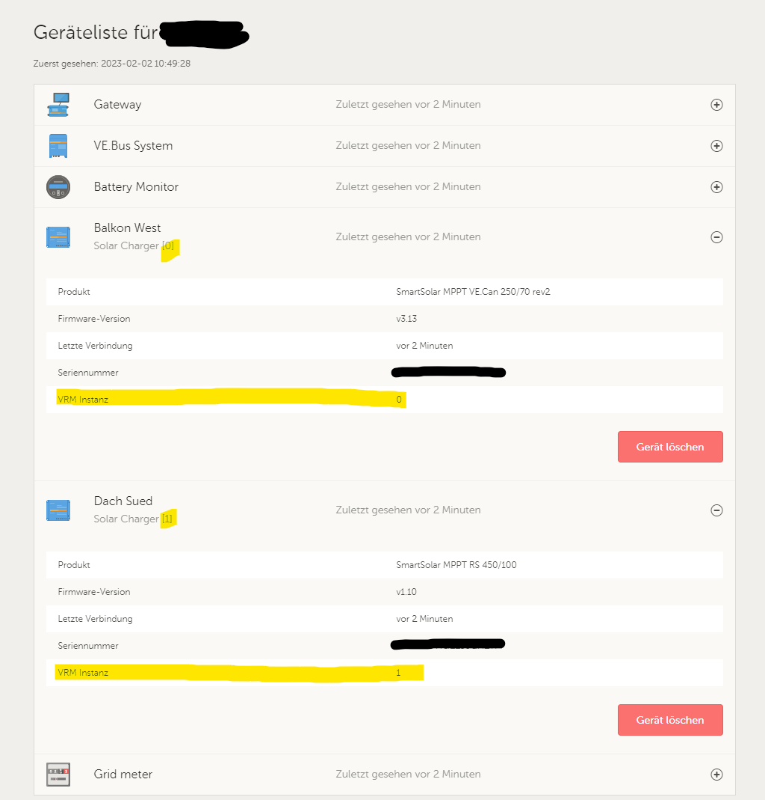

# PV Statistik

Small node.js application to query time series data from Victron VRM API or an InfluxDB v1.x

## dotenv

For secret configuration and user access control a .env file is needed
These keys are supported:

* `SESSION_SECRET` (*) - Random generated string at least 32 characters
* `PORT` - The port on which this web application will listen; defaults to 8080
* `CONTEXT_PATH` - When you need to run the web application in a sub-path of your domain
  like https://mydomain.com/vrm-stats/
* `VRM_ACCESS_TOKEN` - Only needed for Victron VRM Api access
* `USER_CONFIG` - Small JSON object string with username / password pairs

(*) - Mandatory

# Config

The app expects a filed named `config.json` to be in root folder.
See `config.json.example` for possible keys / objects

The config file must contain a list of api objects, this may be multiple or a single api, but it has to be a json array
of objects.

## Solar Charger config

Each solar charger or pv converter needs its own object in the config, either as a `vrm` config type or `influx` config
type

### Victron Api

To use the Victron version of this web application you will need to create an access token in the VRM
Portal https://vrm.victronenergy.com/access-tokens

Copy that generated token to your .env file as VRM_ACCESS_TOKEN

The "instance" field in your config.json file needs to match the instance of you MPPT charger.
This id is shown on the device list. It is the "VRM Instanz" property.



For the VRM portal config you will need the installation id shown in the URL and set it in the config file as "`idSite`"
Example config for VRM portal use:

```
...
"apis": [
  {
    "type": "vrm",
    "idSite": 47110815,
    "charger": [
      {
        "instance": 0,
        "name": "West",
        "mppts": 1
      },
      {
        "instance": 1,
        "name": "Süd",
        "mppts": 2
      }
    ]
  }
]
...
```

With the property `mppts` you can define if a charger as multiple independent mppts. Afaik only the RS 450/x have this

### InfluxDB

Currently only connections without authentication are supported

You need to set a `host`, `database`, `bucket` and the `property` of the generated kWh of the day.
Or you set the complete InfluxQL query as `query` property. Then the fields `bucket` and `property` are not needed.
Example config with `bucket` and `property`:

```
...
"apis": [
  {
    "type": "influx",
    "host": "192.168.0.15",
    "port": 8086,
    "charger": [
      {
        "instance": 0,
        "database": "solar",
        "bucket": "power",
        "name": "Balkonkraftwerk",
        "property": "today"
      }
    ]
  }
]
...
```

Example config with `query`:

```
...
"apis": [
  {
    "type": "influx",
    "host": "192.168.0.15",
    "port": 8086,
    "charger": [
      {
        "instance": 0,
        "database": "solar",
        "name": "Balkonkraftwerk",
        "query": "SELECT max(\"today\") FROM \"power\" WHERE $timeFilter GROUP BY time(1d)"
      }
    ]
  }
]
...
```